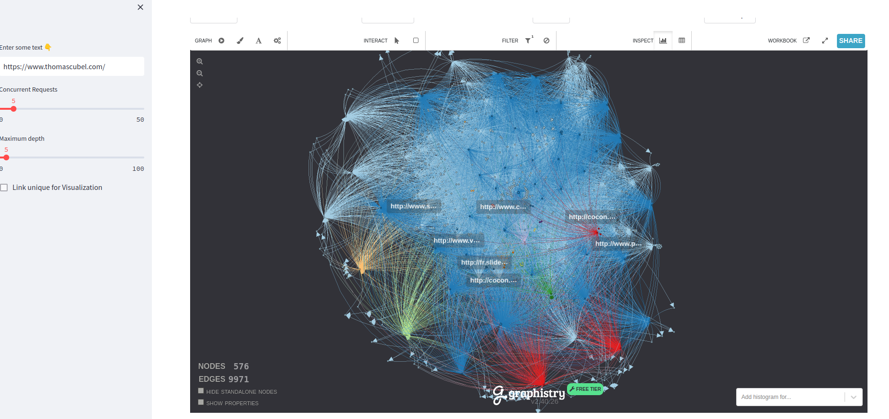
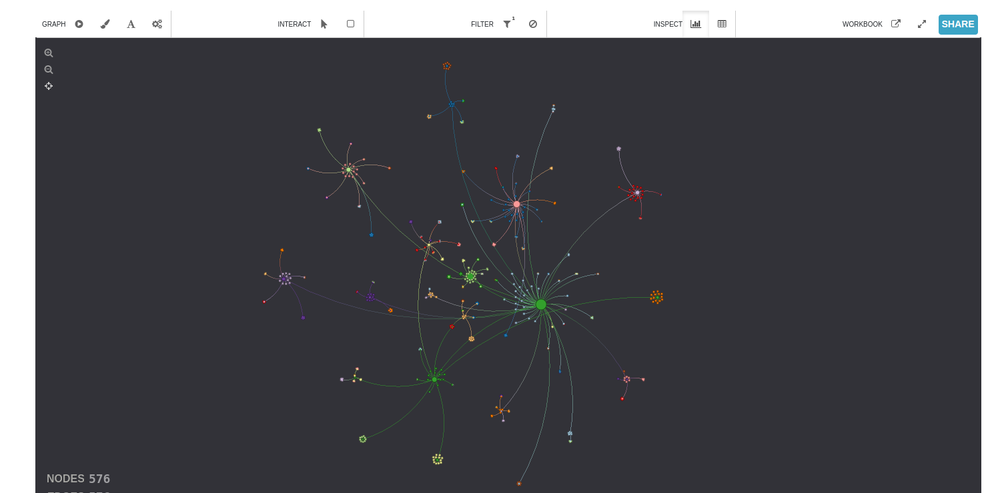
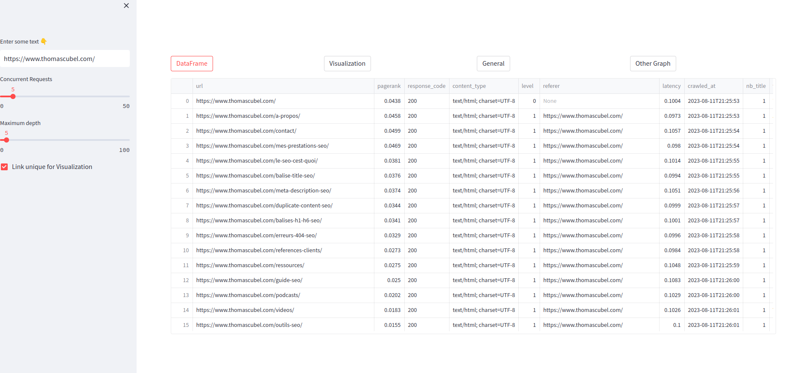
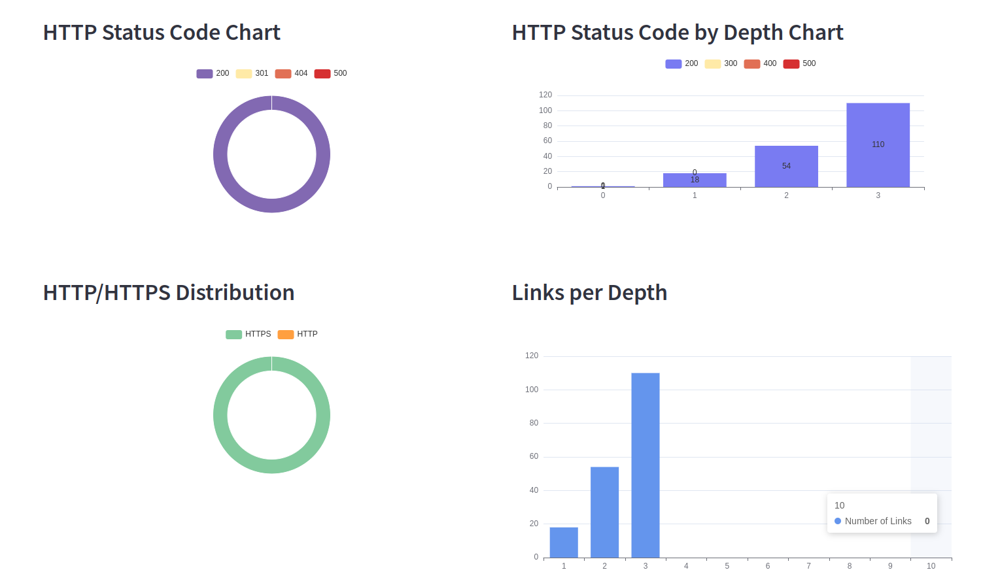
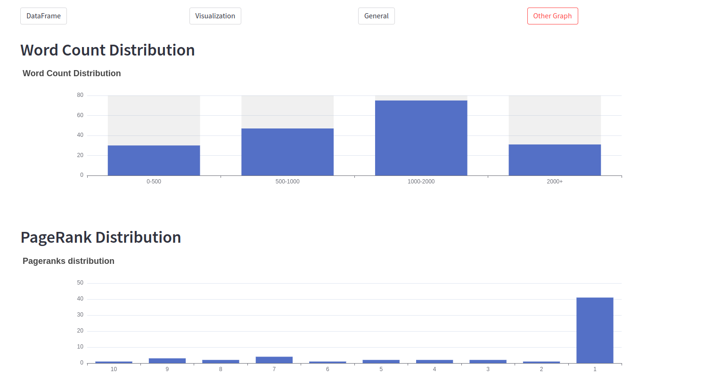

# Crawlit: Web Crawler with Streamlit

This project is a web crawler based on Scrapy (and [Crowl.tech](https://www.crowl.tech/)), enriched by a Streamlit user interface to visualize
and analyze the results.

## Features

- Web Crawler: Uses Scrapy (Crowl) to browse and collect data from specified websites.
- Streamlit interface: Allows interactive visualization and analysis of collected data, including a distribution of PageRanks.
- CSV Export: Ability to export collected data in a CSV format for further processing.

### PageRank
In this project, we use a method to calculate the PageRank of different pages, inspired by the original algorithm.
By adding the concept of the reasonable surfer.

### Visualization with ECharts

We use ECharts, an open source visualization library, to display the distribution of PageRanks of our crawled web pages.
The distribution of response statuses, links by depth, and other information.

#### Chart Features:

- Type: We opted for a bar graph to clearly visualize the distribution of PageRank scores.

- Tooltips: By hovering over each bar, you can see a tooltip that shows the precise number of URLs with that PageRank score.

- Axes: The X axis shows the PageRank score (from 1 to 10), while the Y axis shows the number of URLs corresponding to each score.

## Preview in pictures







## Dependencies
- Scrapy
- Crowl
- Igraph
- Streamlit
- streamlit_echarts
- pymysql
- twisted
- adbapi
- streamlit_apexjs

## Installation

1. Clone repository


```bash
git clone https://github.com/drogbadvc/crawlit.git
```

2. Navigate to the project directory

```bash
cd your_project_name
```

3. Install dependencies
```bash
    pip install -r requirements.txt
```

4. Execution

```bash
    streamlit run graph-streamlit.py
```

## Use

1. Streamlit Interface: Go to http://localhost:8501 in your browser after launching Streamlit.
2. Web Crawler: Please see the Scrapy documentation for more details on running and configuring spiders.